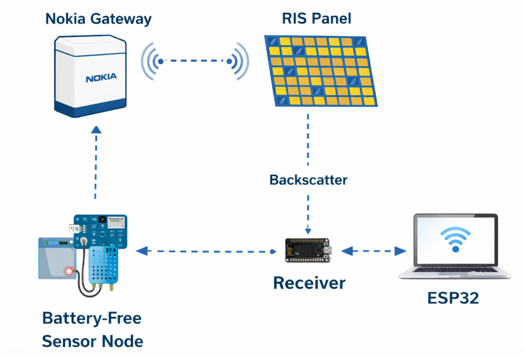

# RIS-Based Battery-Free 6G Indoor Sensor Network

## Overview

This project explores the use of Reconfigurable Intelligent Surface (RIS) technology to improve indoor wireless communication while demonstrating a solar-powered sensor node implementing battery-free communication concepts.

The project combines MATLAB simulations and hardware implementation to evaluate wireless communication performance.

---

## Objectives

- Design an RIS-assisted communication system
- Improve indoor signal propagation
- Evaluate communication performance
- Demonstrate a solar-powered sensor node

---

## Technologies

- MATLAB
- Arduino IDE
- ESP32
- Arduino Nano
- DHT11
- C++

---

## Key Contributions

- Researched and designed an intelligent RIS-assisted indoor wireless communication system.
- Developed and simulated the proposed system using MATLAB.
- Designed and implemented a solar-powered prototype using Arduino Nano, ESP32, DHT11 sensor, and an adaptive RIS controller.
- Evaluated system performance through simulation and experimental testing.

---

## Project Results

See the images and report included in this repository for system architecture, simulation results, and performance evaluation.

### System Architecture

### System Performance

### Simulation Results

---

## Author

Angela Mugwe
